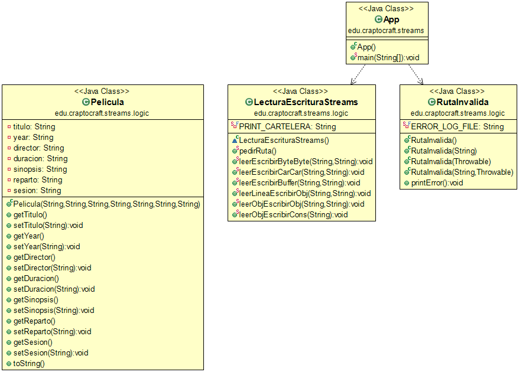
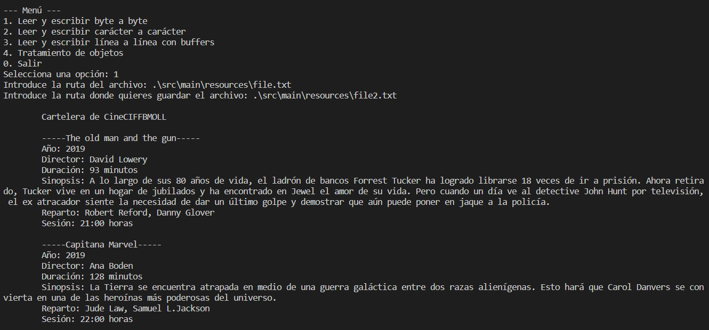
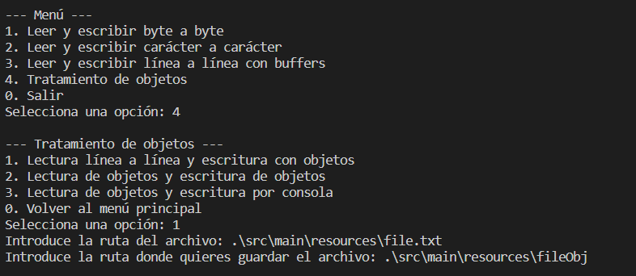
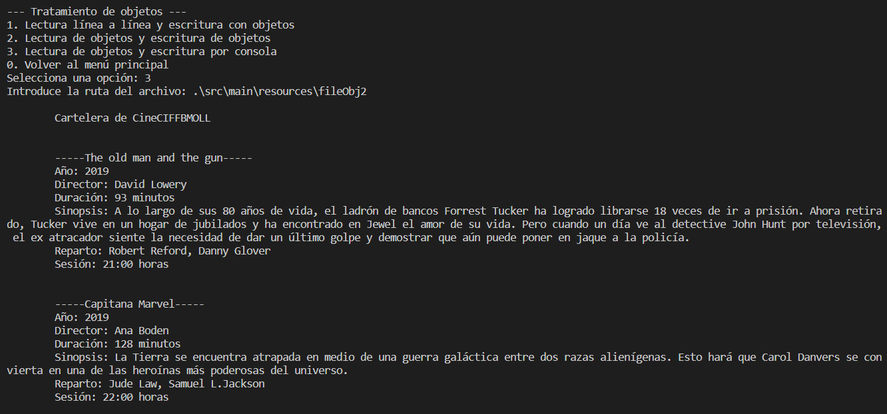
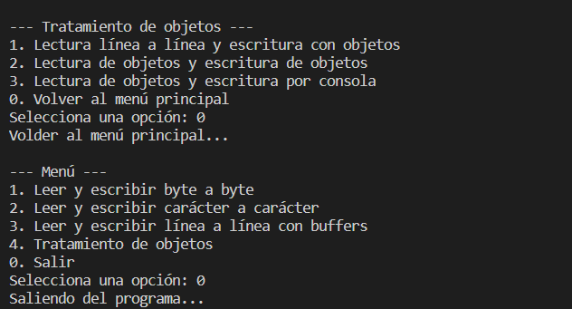

# Java Streams - Práctica

**Tabla de contenidos**

- [Java Streams - Práctica](#java-streams---práctica)
  - [Introducción](#introducción)
  - [Diagrama UML](#diagrama-uml)
  - [Sálida de la aplicación](#sálida-de-la-aplicación)

## Introducción

Práctica propuesta por el profesor de Programación con el objetivo de consolidar los conocimientos adquiridos sobre streams en Java y ponerlos en práctica.

Intrucciones de la práctica: [https://github.com/maximofernandezriera/java-streams](https://github.com/maximofernandezriera/java-streams).

## Diagrama UML

## Sálida de la aplicación

